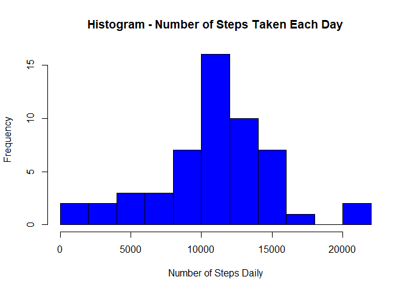
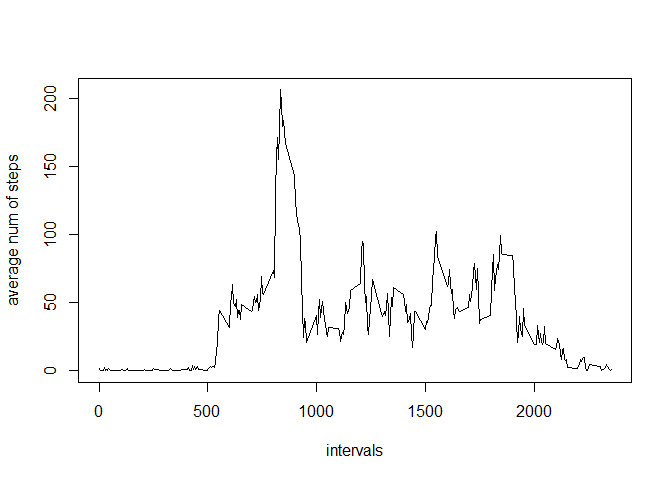
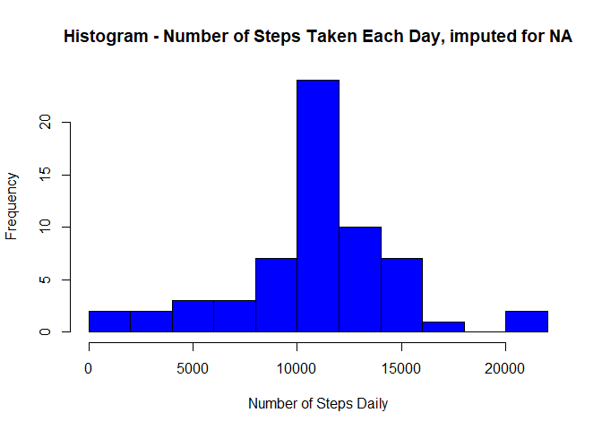
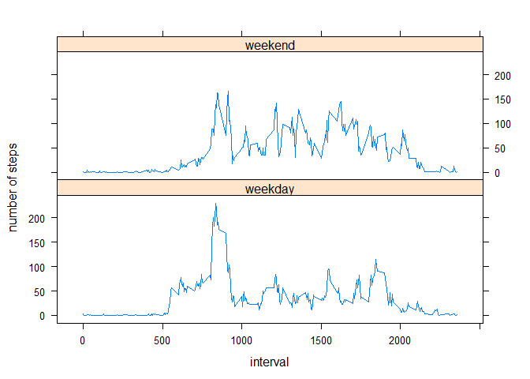

# 1.loading and preprossessing the data

```r
activity <- read.csv("activity.csv", head = TRUE, colClasses =c("integer", "character", "integer"), na.strings="NA")
head(activity)
```

```
##   steps       date interval
## 1    NA 2012-10-01        0
## 2    NA 2012-10-01        5
## 3    NA 2012-10-01       10
## 4    NA 2012-10-01       15
## 5    NA 2012-10-01       20
## 6    NA 2012-10-01       25
```


```r
library(ggplot2)
library(VIM)
```

```
## Loading required package: colorspace
```

```
## Loading required package: grid
```

```
## Loading required package: data.table
```

```
## VIM is ready to use. 
##  Since version 4.0.0 the GUI is in its own package VIMGUI.
## 
##           Please use the package to use the new (and old) GUI.
```

```
## Suggestions and bug-reports can be submitted at: https://github.com/alexkowa/VIM/issues
```

```
## 
## Attaching package: 'VIM'
```

```
## The following object is masked from 'package:datasets':
## 
##     sleep
```

```r
activity$date <- as.Date(activity$date)
## subset and keep only rows with non "NA" steps
activity2 <- subset(activity, !is.na(activity$steps))
```

# 2.histogram of the total number of steps taken each day

```r
sumofsteps <- tapply(activity2$steps, activity2$date, sum, na.rm=TRUE, simplify=T)
sumofsteps <- sumofsteps[!is.na(sumofsteps)]
```


```r
hist(x=sumofsteps,
     main="Histogram - Number of Steps Taken Each Day",
     xlab="Number of Steps Daily",
     ylab="Frequency",
     col="blue",
     breaks=10)
```

<!-- -->

# 3.mean and median no of steps taken per day

```r
mean(sumofsteps)
```

```
## [1] 10766.19
```

```r
median(sumofsteps)
```

```
## [1] 10765
```

# 4.time series plot of the average number of steps per day

```r
avestep <- tapply(activity2$steps, activity2$interval, mean, na.rm=TRUE, simplify=T)
avestep2 <- data.frame(interval=as.integer(names(avestep)), ave=avestep)
```


```r
with(avestep2,
     plot(interval,
          ave,
          type="l",
          xlab="intervals",
          ylab="average num of steps"))
```

<!-- -->

# 5.interval that contain the max no of steps

```r
maxstep <- max(avestep2$ave)
avestep2[avestep2$ave == maxstep, ]
```

```
##     interval      ave
## 835      835 206.1698
```

# 6.imputing missing values

```r
sum(is.na(activity$steps))
```

```
## [1] 2304
```


```r
impute <- activity
nastep <- is.na(impute$steps)
intave <- tapply(activity2$steps, activity2$interval, mean, na.rm=TRUE, simplify=T)
impute$steps[nastep] <- intave[as.character(impute$interval[nastep])]
```

# 7. histogram of the total no of steps taken every day, blanks are imputed with mean for the interval

```r
sumofsteps2 <- tapply(impute$steps, impute$date, sum, na.rm=TRUE, simplify=T)
```


```r
hist(x=sumofsteps2,
     main="Histogram - Number of Steps Taken Each Day, imputed for NA",
     xlab="Number of Steps Daily",
     ylab="Frequency",
     col="blue",
     breaks=10)
```

<!-- -->


```r
mean(sumofsteps2)
```

```
## [1] 10766.19
```

```r
median(sumofsteps2)
```

```
## [1] 10766.19
```

### There is no difference in the mean after impute. The median after impute is higher.

# 8. panel plot comparing the differences in average number of steps between weekdays and weekends

```r
weekday <- function(d) {
  wd <- weekdays(d)
  ifelse (wd == "Saturday" | wd == "Sunday", "weekend", "weekday")
}
wx <- sapply(impute$date, weekday)
impute$wk <- as.factor(wx)
head(impute)
```

```
##       steps       date interval      wk
## 1 1.7169811 2012-10-01        0 weekday
## 2 0.3396226 2012-10-01        5 weekday
## 3 0.1320755 2012-10-01       10 weekday
## 4 0.1509434 2012-10-01       15 weekday
## 5 0.0754717 2012-10-01       20 weekday
## 6 2.0943396 2012-10-01       25 weekday
```


```r
wkactivity <- aggregate(steps ~ wk+interval, data=impute, FUN=mean)

library(lattice)
xyplot(steps ~ interval | factor(wk),
       layout = c(1, 2),
       xlab="interval",
       ylab="number of steps",
       type="l",
       lty=1,
       data=wkactivity)
```

<!-- -->


